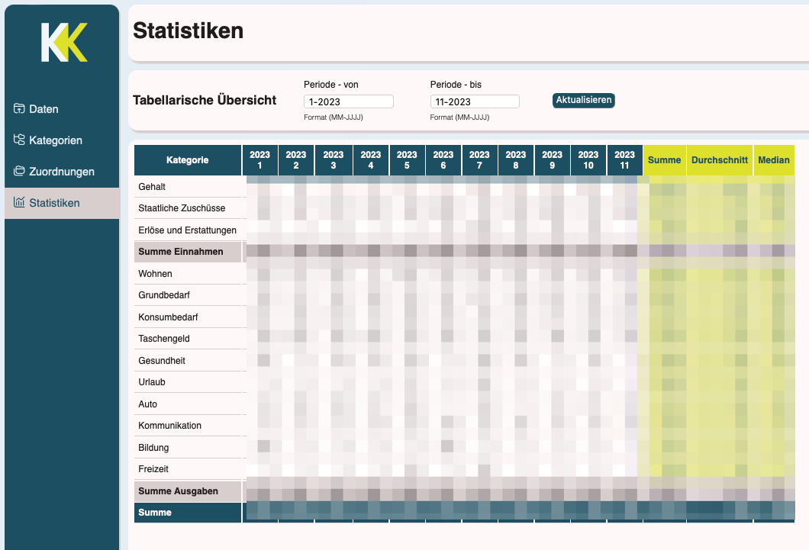
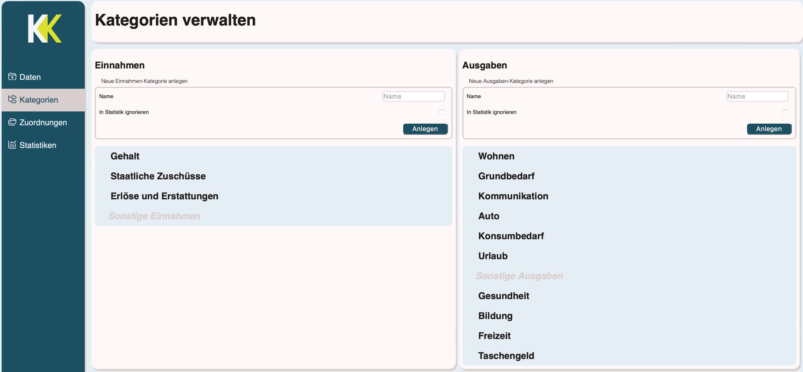
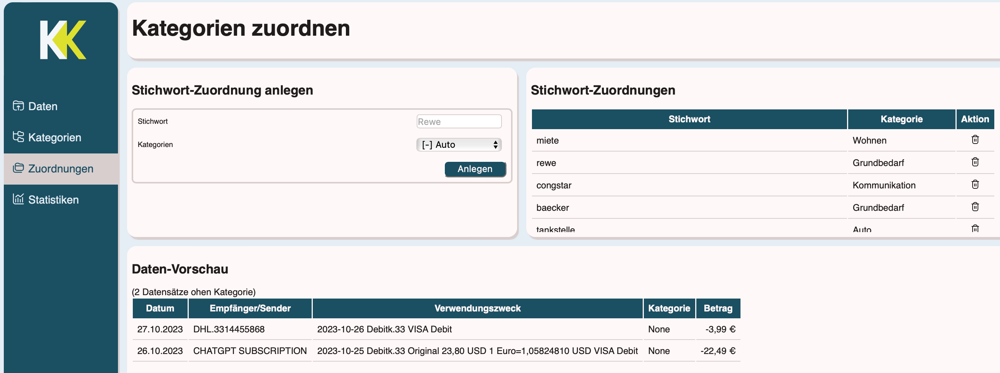

# KontenKlärer
Der KontenKlärer ist ein Hobby-Projekt zur Analyse von Bank-Transaktionsdaten mit einem Kategorisierungssystem. Es handelt sich hierbei um eine Webseite, auf Basis von Django. Es ist derzeit nicht geplant diese Webseite öffentlich zu hosten. 

> [!IMPORTANT] 
> Es gibt ein Nachfolge-Projekt zu diesem, welches neue Funktionen und ein Redesign bietet. 



## Installation
Um den KontenKlärer lokal zu hosten, wird grundsätzlich `Python` und `Django` benötigt. `Django` kann dabei auch in einer virtuellen Umgebung betrieben werden. Zur Minimierung des Speicherplatzes wurde die für dieses Projekt verwendete virtuelle Umgebung nicht auf Github mit veröffentlicht. Über die Liste der Dependencies kann eine virtuelle Umgebung passend aufgebaut werden.
Im Unterverzeichnis `/KontenKlaerer/KontenKlaerer` befindet sich die `manage.py` Datei, welche zum Starten des Servers benötigt wird:

```
python manage.py runserver
```
Danach sollte die Webseite unter http://127.0.0.1:8000/ erreichbar sein.

## Dependencies
* Python==3.12.0
* Django==4.2.7

# Funktionen
Grunsätzlich handelt es sich bei dem KontenKläerer in der aktuellen Version um eine sehr einfache Umsetzung. Die Funktionen sind bewusst simpel gehalten und werden nach persönlichen Bedarf in der Zukunft gegebenfalls ausgebaut. Eine feste Roadmap gibt es nicht. Die aktuelle Version besitzt den gewünschten minimalen Funktionsumfang.

## Hochladen von CSV-Dateien
Der KontenKlärer erlaubt das Hochladen von CSV-Dateien aus dem Internet-Banking. Aktuell wird nur das Dateiformat der DKB-Bank unterstützt. 

## Kategorisierung

Es lassen sich beliebig viele Kategorien für Ausgaben und Einnahmen einrichten. Eine Verschachtelung von Kategorien mit einer Hierachie war ursprünglich vorgesehen, wurde aber schlussendlich nicht viel genutzt, sodass ein simples Kategorisierungs-System verwendet wurde. Das Attribut "in Statistik ignorieren" markiert eine Kategorie als nicht relevant für die spätere Gesamtstatistik. 

## Zuordnungen

Stichwörter lassen sich zuvor erstellen Kategorien zuordnen. Dabei werden die Daten in den Feldern für den Sender, als auch für den Verwendungszweck auf ein Stichwort geprüft. Ist ein Stichwort Teil des Senders/Empfängers oder des Verwendungszweckes wird die entsprechende Buchung dem Stichwort entsprechend kategorisiert.

## Statisiken
Eine einfache tabellarische Übersicht zeigt die Summen, Durchschnitte und Mediane aller kategorisierten Buchungen. Buchungen, die nicht kategorisiert wurden, werden hier nicht berücksichtigt. Der Zeitraum der Auswertung beruht standardmäßig auf den vollen Zeitumfang der zur Verfügung gestellten Daten. Dieser kann beliebig eingeschränkt werden.
Durch das Anwählen/Klicken eines Betrages in der Statistik wird unten eine weitere Detail-Tabelle ausgegeben, die die Buchungen anzeigt, welche dem angewählten Betrag zu Grunde liegen.